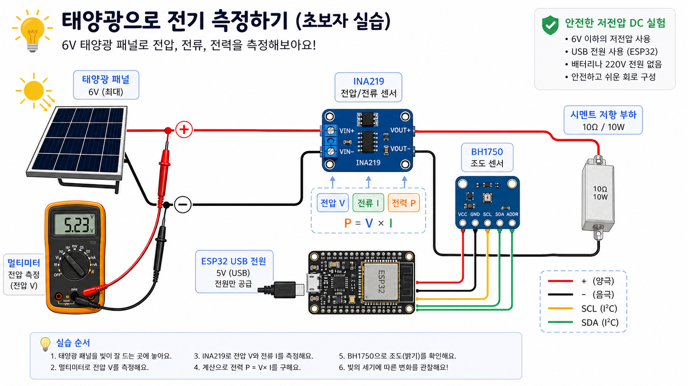

# 원룸 태양광 실험실

이 문서는 SNP-5MA(6V 5W 태양광 패널), UNI-T UT33A+, ESP32 DevKitC, INA219, BH1750, 브레드보드, 시멘트 저항을 사용해서 안전하게 전기를 측정하고 기록하는 첫 프로젝트를 진행하기 위한 안내서다.

## 목표

1. 사용자는 태양광 패널의 극성(+/-)을 구분할 수 있다.
2. 사용자는 멀티미터로 태양광 패널의 DC 전압을 안전하게 측정할 수 있다.
3. 사용자는 INA219로 태양광 패널의 전압과 전류를 읽을 수 있다.
4. 사용자는 ESP32로 측정값을 읽고 시리얼로 출력할 수 있다.
5. 사용자는 맥미니 또는 우분투 노트북에서 측정 로그를 저장할 수 있다.

## 문서 순서

- docs/01-project-overview.md
- docs/02-safety-rules.md
- docs/03-inventory.md
- docs/04-day1-panel-multimeter.md
- docs/05-day2-wire-and-load.md
- docs/06-day3-ina219.md
- docs/07-day4-bh1750.md
- docs/08-day5-esp32-serial.md
- docs/09-log-template.md
- docs/10-common-mistakes.md
- docs/11-next-steps.md

## 확장 학습서

전기 초심자가 태양광, ESP32, 아두이노식 IoT 실험을 재미있게 따라가면서 전기기사 기초 감각까지 같이 키울 수 있도록 `curriculum/` 아래에 3권짜리 학습서 구조를 추가했다.

- curriculum/README.md
- curriculum/visual-guide.md
- curriculum/expanded-study-pack.md
- curriculum/workbook-150-questions.md
- curriculum/macos-arduino-esp32-setup.md
- curriculum/volume-1-electricity-basics.md
- curriculum/volume-2-esp32-iot.md
- curriculum/volume-3-solar-power-and-exam.md
- curriculum/project-atlas-60.md
- curriculum/electrician-exam-bridge.md
- curriculum/source-index.md
- curriculum/templates/experiment-note.md

## 큰 원칙

처음에는 전기를 많이 쓰는 사람이 아니라 전기를 정확히 보는 사람이 된다.

이 저장소의 실습은 낮은 전압 DC 실험, 센서 측정, 로그 기록, 계산 연습을 중심으로 한다. 220V 콘센트, 배전반, 인버터, 리튬 배터리 충전 회로의 장시간 무인 운전은 이 문서만 보고 진행하지 않는다.
