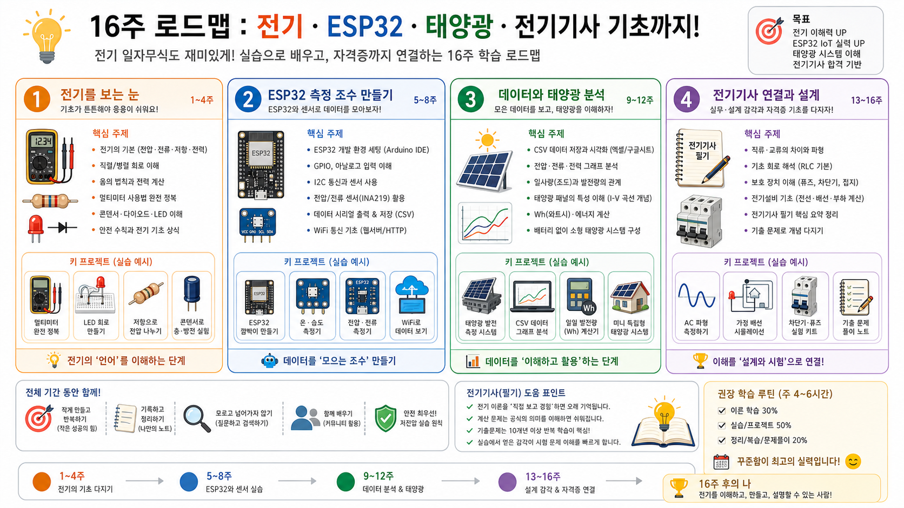

# ESP32 태양광 전기 입문 커리큘럼

이 폴더는 전기를 거의 모르는 상태에서 시작해도, 작은 태양광 패널과 ESP32로 직접 숫자를 보고 기록하면서 전기 감각을 키우는 학습서다.

목표는 세 가지다.

1. 전압, 전류, 저항, 전력, 에너지를 손으로 만져본 숫자로 이해한다.
2. ESP32와 아두이노 생태계를 이용해 센서, 로그, 웹, 무선 통신을 체험한다.
3. 전기기사 필기/실기에서 반복되는 개념을 작은 실험과 연결한다.

## 읽는 순서

1. [1권 - 전기 초심자를 위한 손실험 전기학](./volume-1-electricity-basics.md)
2. [2권 - ESP32와 아두이노식 IoT 만들기](./volume-2-esp32-iot.md)
3. [3권 - 태양광, 전력 계산, 전기기사 연결](./volume-3-solar-power-and-exam.md)
4. [그림으로 보는 전체 안내](./visual-guide.md)
5. [확장 학습팩](./expanded-study-pack.md)
6. [150문제 문제은행](./workbook-150-questions.md)
7. [macOS에서 Arduino IDE와 ESP32 시작하기](./macos-arduino-esp32-setup.md)
8. [60개 프로젝트 백과](./project-atlas-60.md)
9. [전기기사 연결표](./electrician-exam-bridge.md)
10. [출처 색인](./source-index.md)

## 그림 먼저 보기

## 이 커리큘럼의 안전 경계

해도 되는 것:

- 6V급 소형 태양광 패널의 DC 전압 측정
- 시멘트 저항 같은 단순 부하 연결
- ESP32를 USB 전원으로 켠 상태에서 INA219, BH1750 같은 센서 읽기
- CSV 로그 저장, 그래프 작성, 웹 대시보드 만들기
- 계산으로 전력, 에너지, 효율을 추정하기

지금 하지 않는 것:

- 220V AC 콘센트, 전등선, 분전반 실험
- 리튬 배터리 직접 충전 회로 제작
- 인버터 연결
- 태양광 패널을 ESP32 전원에 직접 연결
- 무인 장시간 충전 실험

## 공부 방식

하루에 하나만 바꿔라. 배선을 바꿨으면 코드는 그대로 두고, 코드를 바꿨으면 배선은 그대로 둔다. 초심자에게 가장 위험한 순간은 모르는 변수가 동시에 두 개 이상 늘어나는 순간이다.

각 실험은 아래 순서로 남긴다.

1. 오늘의 질문
2. 연결한 부품
3. 예상값
4. 실제 측정값
5. 오차가 난 이유
6. 전기기사 과목과의 연결

실험 기록은 [실험 노트 템플릿](./templates/experiment-note.md)을 복사해서 쓰면 된다.

## 3권 구성

1권은 전기를 겁내지 않고 다루기 위한 기본 언어다. 전압, 전류, 저항, 전력, 직렬/병렬, 멀티미터, 발열, 센서 측정을 다룬다.

2권은 ESP32를 작은 측정 컴퓨터로 쓰는 방법이다. Arduino IDE, I2C, ADC, 시리얼, 웹 서버, MQTT, deep sleep, 데이터 로그를 다룬다.

3권은 태양광과 전기기사 쪽 연결이다. PV 패널의 I-V 곡선, 부하선, MPPT 감각, 에너지 예산, 전기기사 과목별 연결, 실기형 계산 감각을 다룬다.

## 추천 첫 루트

완전 초심자라면 아래 10개만 먼저 끝내도 충분히 많이 배운다.

1. 패널 전압을 멀티미터로 재기
2. 100옴 저항을 연결하고 전압이 어떻게 바뀌는지 보기
3. 저항의 소비전력 계산하기
4. INA219로 전압과 전류 읽기
5. BH1750으로 밝기 읽기
6. 전압, 전류, 전력, 조도를 한 줄 CSV로 저장하기
7. 하루 동안 30분마다 측정하기
8. 그래프로 전력과 조도를 비교하기
9. ESP32 웹 페이지에 현재값 띄우기
10. 전기기사 회로이론 문제처럼 옴의 법칙 문제 20개 직접 만들기
