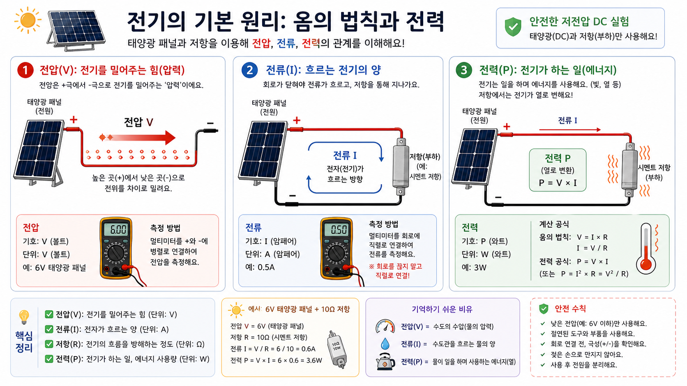
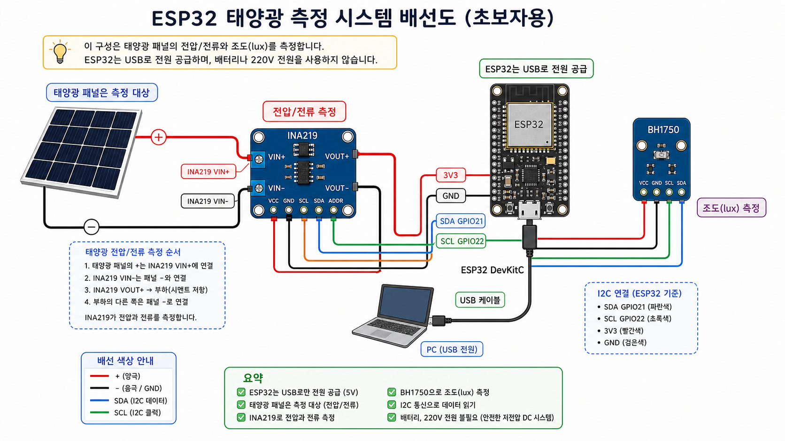
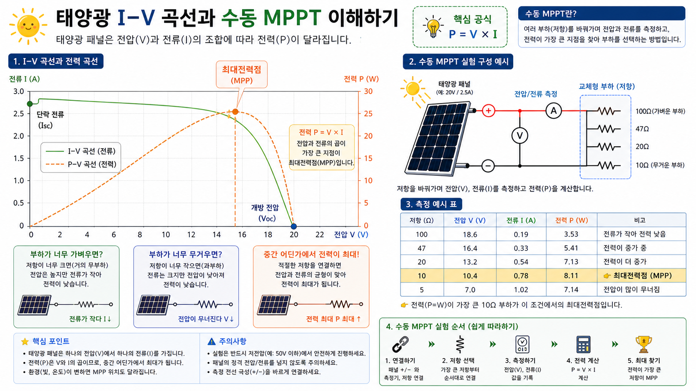
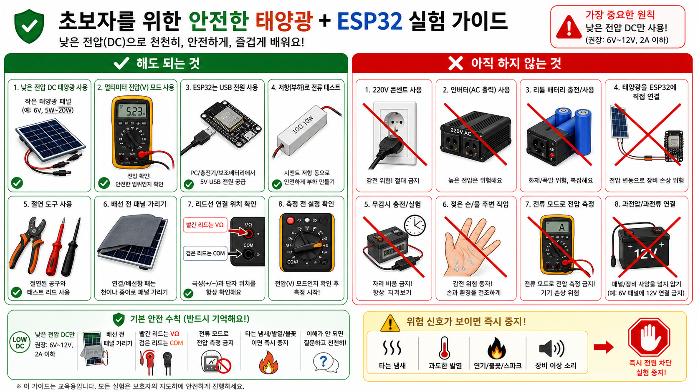

# 그림으로 보는 ESP32 태양광 전기 입문

이 문서는 글을 읽기 전에 큰 그림을 잡는 용도다. 각 그림은 `gpt-image-2` 이미지 생성 툴로 만든 교육용 시각 자료다.

## 1. 전체 실험 개요


이 실험실의 중심 생각은 단순하다.

태양광 패널은 전기를 만드는 대상이고, ESP32는 그 전기를 직접 먹는 장치가 아니라 숫자를 읽고 기록하는 측정 조수다. ESP32는 USB로 안전하게 전원을 받고, 태양광 패널 쪽 전압과 전류는 INA219가 읽는다. BH1750은 빛의 밝기를 lux로 읽는다. 시멘트 저항은 전기를 안전하게 소비하는 부하다.

초심자가 이 그림에서 꼭 기억할 것:

- 태양광 패널을 ESP32 3.3V 핀에 직접 연결하지 않는다.
- ESP32는 USB 전원으로 켠다.
- 패널 쪽은 측정 대상이다.
- 저항은 전기를 열로 바꾸는 단순 부하다.
- 전압, 전류, 전력, 조도를 같이 기록하면 전기가 숫자로 보인다.

## 2. 옴의 법칙과 전력



전기 입문의 첫 공식은 아래 세 개다.

```text
V = I * R
I = V / R
P = V * I
```

전압은 밀어주는 차이, 전류는 닫힌 길에서 흐르는 양, 저항은 흐름을 제한하는 정도, 전력은 그 순간 쓰는 에너지 속도다.

저항 실험에서 해야 할 말:

```text
저항값이 작아지면 같은 전압에서 전류가 커진다.
전류가 커지면 전력과 발열도 커진다.
전력은 숫자로 계산하고 발열은 손대지 말고 관찰한다.
```

## 3. ESP32와 센서 배선



ESP32 쪽 배선은 두 영역으로 나눠서 보면 쉽다.

센서 통신 영역:

- ESP32 `3V3` -> INA219/BH1750 전원
- ESP32 `GND` -> INA219/BH1750 GND
- ESP32 `GPIO21` -> SDA
- ESP32 `GPIO22` -> SCL

태양광 측정 영역:

```text
패널 + -> INA219 VIN+ -> INA219 VIN- -> 시멘트 저항 -> 패널 -
```

이 구조가 중요한 이유는 전류 측정기가 전류가 지나가는 길 위에 있어야 하기 때문이다.

## 4. I-V 곡선과 수동 MPPT



태양광 패널은 부하에 따라 전압과 전류가 달라진다.

부하가 너무 가벼우면 전압은 높지만 전류가 작다. 부하가 너무 무거우면 전류를 많이 요구하다가 패널 전압이 무너진다. 중간 어딘가에서 `P = V * I`가 가장 커진다.

초심자용 수동 MPPT 실험:

1. 100옴 저항을 연결하고 전압/전류를 기록한다.
2. 47옴 저항으로 바꾸고 기록한다.
3. 20옴 저항으로 바꾸고 기록한다.
4. 10옴 저항으로 바꾸고 기록한다.
5. 각 지점의 전력을 계산한다.
6. 가장 큰 전력이 나온 저항을 찾는다.

이 실험 하나가 회로이론의 부하, 전력공학의 발전원, 실기의 측정표 작성과 연결된다.

## 5. 안전 경계



이 저장소의 기본 범위는 낮은 전압 DC 실험이다.

해도 되는 것:

- 멀티미터 DC 전압 측정
- 저항 부하 연결
- ESP32 USB 전원
- INA219/BH1750 센서 측정
- CSV 로그와 그래프

아직 하지 않는 것:

- 220V 콘센트
- 인버터
- 리튬 배터리 직접 충전
- 태양광 패널을 ESP32 전원에 직접 연결
- 무인 장시간 충전

멈춰야 하는 신호:

- 타는 냄새
- 불꽃
- 전선 발열
- 저항 과열
- 무엇을 연결했는지 설명할 수 없음

## 6. 16주 학습 로드맵


추천 흐름은 네 단계다.

1. 전기를 보는 눈 만들기
2. ESP32 측정 조수 만들기
3. 데이터와 태양광 분석
4. 전기기사 연결과 설계

각 단계의 산출물은 꼭 남긴다. 실험 노트, CSV, 그래프, 계산 과정, 안전 체크리스트가 쌓이면 나중에 전기기사 공부를 할 때 추상적인 공식이 실제 장면으로 바뀐다.
